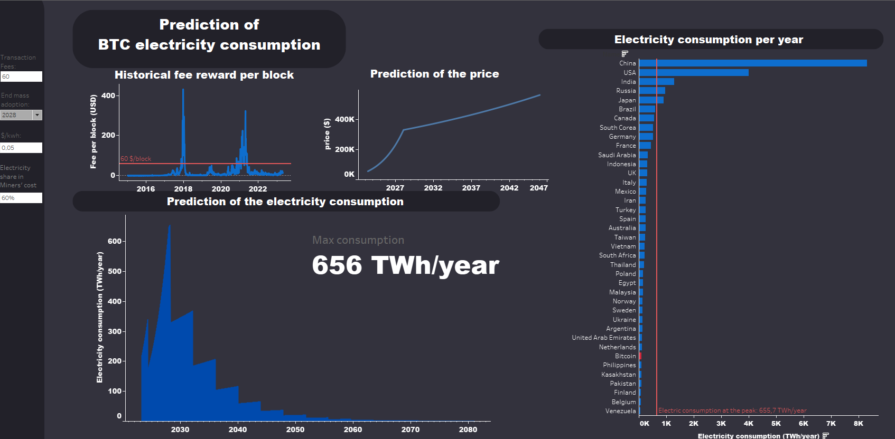

# Electricity consumption of the Bitcoin network

[__Jumpertz Sacha__](www.linkedin.com/in/jumpertz-sacha)

Some time ago I discovered crypto currencies and their advantages: data ownership, decentralization, transparency,... I quickly got interested in the technology and to be honest in the possible profit promised by some "online crypto gurus". Given the controversial nature of cryptocurrencies I couldn’t stop hearing that they were only useless ponzi scheme with a disastrous impact on our beloved planet. 

Ecology and sustainability have always been an important subjects to me so I couldn’t ignore those criticisms any longer.

Unfortunately I soon realized that finding unbiased answers was hard. Bitcoin’s maximalists claim that it uses mostly green energy, wasted otherwise, and Bitcoin’s detractors warn that Bitcoin alone could push global warming above 2°C.

This is the reason I choose to make this project.

## Execution steps

* Read
* Collect datas
* Make prediction in python
* Create a report where I will show my analysis
* Build a dashboard

### Read
This first part was dedicated to read what has already been done on this subject. Bitcoin is more than 10 years old and I was not the only one to wonder about its electricity consumption. You can find the names of those
articles in the resources section of the [final report](./Results). 

This was insightfull and enabled me to know where I could find the datas I needed for the next part:
* https://www.blockchain.com/explorer/api
* https://ccaf.io/cbnsi/cbeci
* https://digiconomist.net/bitcoin-energy-consumption

### Collect Datas
In this part I collected the datas I needed to do my analysis. You can find the codes to collect, clean and transform these datas into the file [get_from_api](./Codes). At the end of this file I had in my table the following columns:
* Date : from 2010 to 2023 each 3 days
* Hashrate : hashrate of the network
* Fees(sat) : amount of the fees per transaction in satoshi
* Nb_trans : the number of transaction on the timestamp
* Nb_trans_block : average number of transaction per block
* Price : BTC price
* Fee_per_block : the amount of fees for one block
* Block_reward : the rewards for mining (in BTC), without the fees
* Electricity(TWh): calculated electricity consumption, in TWh/year
* Cambridge_MAX(TWh): estimation(max) per Cambridge, in TWh/year
* Cambridge_MIN(TWh): estimation(min) per Cambridge, in TWh/year
* Cambridge_GUESS(TWh): estimation(best guess) per Cambridge, in TWh/year
* Dig_Guess(TWh): estimation(best guess) per Digiconomist, in TWh/year
* Dig_MIN(TWh): estimation(min) per Digiconomist, in TWh/year

### Make prediction
From the collected data and with the assumptions described in the [final report](./Results), it is now time to predict the consumption of the network. You can find all these codes in the file [create_prediction_btc](./Codes).

### Create the final report
[final report](./Results)

### Build a dashboard
In the report we learn that the consumption of the network is a function of some parameters. The dashboard I built is a tool that enables to change these parameters and see the changement in the electricity consumption. You can find this dashboard on this link: https://public.tableau.com/views/Blockchain_consumption/Dashboardpresentation?:language=fr-FR&:display_count=n&:origin=viz_share_link

